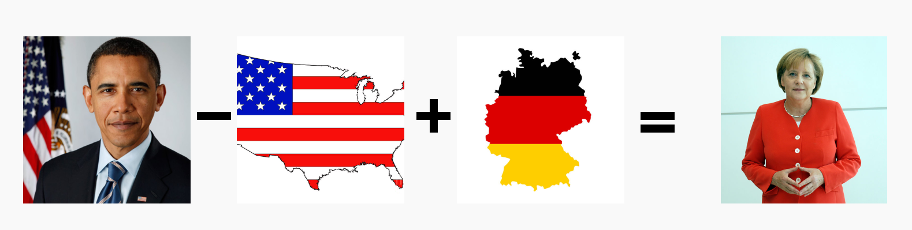

# Chain-of-Thought Prompting and Visual Arithmetic Tasks: Exploring Grounding in FROMAGe
> Joy Crosbie, Emile Dhifallah, Dominik Martínez, Gergely Papp, Nils Peters

## Introduction

### FROMAGe

In the era of evergrowing language models, a key challenge to obtaining models that can reason about vision and text lies in the lack of multimodal grounding. Language models (LMs), are trained on massive text corpora and demonstrate impressive capabilities such as generating human-like dialogue, answering complex questions, and learning new tasks from very few examples. Despite this, they are generally incapable of incorporating visual cues. This significantly limits their performance on tasks that require visual reasoning and grounding. The paper, "Grounding Language Models to Images for Multimodal Generation", addresses this limitation by introducing FROMAGe (Frozen Retrieval Over Multimodal Data for Autoregressive Generation), a foundational framework which extends the semantic capabilities of LMs to a multimodal (text and image) realm in a very efficient manner.

FROMAGe (Koh et al., 2023) employs a pretrained language model and the encoder of a vision transformer (ViT), both kept frozen, to ground language models visually. This grounding is achieved by training the model with a multitask objective for image captioning and image-text retrieval. For image captioning, the model learns to extract visual embeddings and map them into the input space of the language model through a maximum likelihood objective. On the other hand, for text-image retrieval, the model uses contrastive learning to map the embeddings of a new [RET] token, which represents an image to be retrieved, to the corresponding visual embeddings. This process only updates the weights of the linear layers and the [RET] token embedding, ensuring computation and memory efficiency. The authors of FROMAGe explicitly refrain from fine-tuning either of the models because this would adapt the parameter configurations that make these models so powerful in their respective domains intact. They reason this enables better generalization for in-context learning.

The paper by Koh et al. (2023) highlights several key strengths of the proposed model. Firstly, FROMAGe retains the original abilities of the text-only language model, such as text generation, while also acquiring new multimodal dialogue and reasoning abilities. Secondly, the model demonstrates strong few-shot multimodal abilities learned from image-caption pairs alone, which is a standout feature as most models require web-scale interleaved image-text data (Alayrac et al., 2022; Aghajanyan et al., 2022). Thirdly, it demonstrates superior text-to-image retrieval sensitivity, especially for long and complex free-form text. Lastly, FROMAGe enhances the existing capabilities of pretrained language models, such as in-context learning, input sensitivity, and dialogue generation, for visually grounded tasks. 

### Visual Arithmetic Tasks and Grounding
In the context of deep learning, visual arithmetic tasks are not about traditional numerical operations, but rather about finding analogies or relationships between different entities. This concept takes inspiration from the vector arithmetic introduced by Mikolov et al. (2013). In their work, they demonstrated that word embeddings can be manipulated using arithmetic operations to reveal semantic relationships between words. Extending this idea into the visual domain, visual arithmetic tasks involve understanding and applying a transformation observed in a pair of images to another pair. A classic example would be: if "Obama" is to "USA" as "X" is to "Germany", what is "X"? The correct answer would ideally be "Angela Merkel", following the logic of leaders to their respective countries.

Building on this concept, Tewel et al. (2022) in their work on ZeroCap, applied arithmetic operations to visual embeddings to "generate knowledge of the external world". They perform calculations over a combination of visual and textual inputs by operating in the latent embedding space. However, their methodology relies on CLIP (Radford et al., 2021), a model that can handle visual and textual inputs but only generates textual outputs, thus limiting their arithmetic to natural language output:

> "Who is the president of Germany?"\
> X = image(Obama) - image(USA) + image(Germany) &rarr; "Angela Merkel"
> 

Visual arithmetic tasks provide an interesting paradigm for exploring the grounding capabilities of multimodal language models. These tasks involve the ability to comprehend, reason, and make decisions based on visual inputs - a challenge that requires a deep level of grounding in the visual world. By applying the FROMAGe model to these tasks, we can gain a better understanding of the extent to which it is truly "grounded". Moreover, with FROMAGe's ability to process and output multimodal data, we are equipped to extend the arithmetic operations’ output into the visual domain, overcoming the limitations faced by models such as CLIP.

## Novel Contributions
Our novel contributions include:
* Building upon the foundational paper that introduced FROMAGe, by offering novel insights into its visual arithmetic capabilities. Our findings will illustrate whether the model can successfully execute complex visual arithmetic operations, thereby broadening our comprehension of FROMAGe's functionality and potential applications.
* Evaluating the impact of latent few-shot in-context learning abilities of large language models (LLMs) on visual arithmetic. By investigating Chain-of-Thought reasoning on a task and modality that these LLMs are not trained on, we present the in-context abilities from a unique viewpoint divergent from previous literature. Our research discloses how the model effectively generalizes from limited examples, markedly enhancing the efficiency and precision of visual arithmetic operations.
* Demonstrating the influence of multimodal inputs on visual arithmetic. We furnish a deeper understanding of the interaction between different modalities in multimodal models, especially in tasks they are not trained on. The insights derived from this exploration bear significant implications for how multimodal models should be trained and utilized.

## Methodology: FROMAGe's Approach to Visual Analogy Resolution

### Visual Relations Benchmark
In order to investigate how we can use FROMAGe for visual arithmetics, we want to evaluate how well it can retrieve relevant visual data, given visual input and optional additional instruction prompts. We make use of the Visual Relations Benchmark introduced in the ZeroCap (Tewel et al., 2023) paper. This benchmark encompasses 320 distinct relationships distributed among multiple image templates, such as buildings→countries, countries→capitals, foods→countries, leaders→countries, and CEOs→companies. These relations were specifically chosen for their many-to-one association, exemplified by the fact that a country can host a myriad of buildings, yet each building typically pertains to a single country. The benchmark is devised to gauge two primary capabilities: the modeling of visual relations and the application of world knowledge in task execution. Although originally devised for single-word answer generation, this dataset also facilitates the retrieval of images that correctly demonstrate visual arithmetic. It is therefore able to handle the multi-modal arithmetics that will be performed using FROMAGe.

### Mapping, Generation, and Retrieval 
To apply the FROMAGe model to visual analogy resolution, the following steps are involved. First, each image in the benchmark is processed using the visual encoder to extract its visual embedding. EXPLAIN THAT THIS IS AHEAD OF TIME. During prompting, the visual embeddings in the analogy question are mapped to the language model's input space using a linear layer trained during training. The [RET] token is then appended to the end of each mapped prompt, forming a complete input sequence.

Next, the input sequence is passed through the language model, which performs the analogy arithmetic and generates output representations. To map these representations to the visual space for retrieval, the representation of the [RET] token from the last hidden layer of the language model is fed through another linear layer trained during training.

Finally, the resulting embedding is compared to the precomputed embeddings of the benchmark images using normalized cosine similarity. Based on the computed similarity, the most similar image is retrieved as the resolution to the visual analogy.

[Figure 1 visualizing how the model does the above]

### Prompting Strategies
We explore various prompting strategies.
#### Zero-shot W2V inspired approach
The simplest approach is that insipred by Word2Vec, where the analogy resolution (i.e. image arithmetic) is explicitly performed on the image embeddings prior to prompting. 

[EXAMPLE OF PROMPT WILL BE SHOWN HERE] @feedbackers: this means that the prompt consists of a single embedding, for instance computed by: embedding(image_Obama) - embedding(image_USA) + embedding(image_Germany) 

(@Feedbackers: Examples can be seen in [example](https://github.com/nils2/DL2-ZeroVis/blob/main/demos/example.ipynb) and in [arithmetic](https://github.com/nils2/DL2-ZeroVis/blob/main/demos/visual_arithmetics/arithmetic.ipynb)).
#### Zero-shot prompting 
The following approach consists of textual prompts.

#### Chain-of-Thought Prompting for Visual Arithmetic
Chain-of-thought prompting is a technique aimed at enhancing the reasoning ability of large language models. Rather than presenting a prompt in isolation, it involves including a series of intermediate reasoning steps in natural language within the few-shot prompting process (Kojima et al. 2022). This has been shown to improve performance, particularly for complex reasoning tasks (Wei et al. 2022, Suzgun et al. 2022). When applied in combination with visual arithmetic tasks, it can offer deeper insights into how well the model understands and connects visual and linguistic cues.

In the context of visual arithmetic tasks, chain-of-thought prompting would involve presenting the FROMAGe model with a set of visual analogies along with a series of intermediate reasoning steps. For instance, instead of directly asking "Obama is to the USA as X is to Germany", the model would be guided through the reasoning process: 

##### Zero-shot CoT prompting 
EXAMPLE OF PROMPT WILL BE SHOWN HERE
##### Few-shot CoT prompting 
EXAMPLE OF PROMPT WILL BE SHOWN HERE

## Discussion

With our experiments, we shed light on the multimodal capabilities of FROMAGe. While some results demonstrate that the model is capable of performing visual arithmetics, our examples also highlight that the model often struggled to complete the task.

### Limitations of the LLM
*(working title as it depends on our findings)*

To gain insights into the underlying causes of this low performance, we conducted an analysis of the latent representations, hoping to get an insight on stages prior to the retrieval of the output images. We employed t-Distributed Stochastic Neighbor Embedding (T-SNE) (Van der Maaten et al., 2008) to compare latent representations of the data while being processed by the model.

T-SNE is a non-linear dimensionality reduction technique known for its ability to preserve local structure within high-dimensional datasets. It calculates the similarity of data points in the high-dimensional space and maps it to a lower-dimensional space. This technique leverages gradient descent to minimize the Kullback-Leibler divergence between the high and low-dimensional representations, determining the optimal locations of the points in the map. We employed this dimensionality reduction algorithm to visualize non-linear relations between the latent representations, facilitating a more comprehensive analysis and an easily interpretable visualization of their relations.

To ascertain whether the model faced inherent difficulties in performing the task, we downcast the multi-dimensional representation of the LLM's output just before retrieving the output images. Our rationale behind this approach is to evaluate whether the latent output representation closely resembles the representation of the expected image output.If the latent output representation aligns well with the desired image, it indicates that the LLM handles the task effectively, with any performance issues lying in the retrieval stage. Conversely, unexpected latent output representations would suggest that the model indeed struggles to complete the task.

*(add examples and interpretation here)*

### Susceptibility to textual input

During our experiments, we observed significant disparities in the quality of the model's output that could be triggered by minor variations in the input. Remarkably, even slight differences in word capitalization could yield crucial distinctions when attempting to retrieve images. To illustrate this phenomenon, we present a striking example involving the terms "apple" and "Apple." When prompting for an "Image of apple the company," the model retrieves images of apples as fruits. However, capitalizing "Apple" in the same prompt leads to the retrieval of Apple's logo. Nonetheless, it is worth noting that standardized capitalization does not guarantee favorable results, as demonstrated by another example involving the term "Australia." When prompted for an "Image of australia the flag", the model initially retrieves the flag of South Africa, with only the second and third images representing Australia's flag. Intriguingly, capitalizing "Australia" in the same prompt results in a degraded output, featuring just one Australian flag among the first three retrieved images. These subtle disparities in the textual input are beyond our control but can significantly influence the model's performance.

### Limitations of the benchmark
In addition to its small size, the Visual Relations dataset possesses a notable shortcoming in terms of category definition. To illustrate this, we once again employed T-SNE, this time appyling it to the output of the linear translation layer, i.e., the textual representation of the image input.

The resulting T-SNE plot reveals certain category intertanglements. One such intertanglement can be observed between the categories *countries* and *flags*. Their close proximity in the plot raises questions about the justification of treating them as distinct categories, especially since images representing countries often feature the country's flag. Moreover, the categories, of *CEOs* and *leaders* form a combined cluster in the plot, although this cluster could just contain representations of people. Another potentially problematic cluster emerged between the categories of *cities* and *buildings*.

*(include T-SNE plot here)*

The confusion between *countries* and *flags* becomes evident not only in the T-SNE plot but also in the relations and images themselves. While Tewel et al. (2013) describe a relation *countries* -> *flags*, not all of the examples within this relation can be accurately expressed using the available images. For instance, since *Australia* is exclusively present in the *flags* category and not in *countries*, the example *Australia -> Canberra* can only be expressed as a *flags -> cities* relation.

*(do we mention the confusion regarding number of images / number of relations?)*

### Limitations of the retrieval dataset

The choice to retrieve output images rather than generating them is an intentional design decision made by the authors of FROMAGe. This decision offers certain advantages, such as the ability to exercise control over the output by curating the data, but it also entails limitations in terms of image flexibility.

One notable limitation arises from the specific dataset employed in FROMAGe, which is stored in a decentralized manner and lacks long-term availability guarantees. Consequently, some of the images linked to through the provided URLs are no longer accessible. To address this issue, we employ a fallback approach that retrieves the next-best output while indicating the position of the image candidate. However, it is important to note that if the output at a specific position is suboptimal, our ability to draw comprehensive conclusions about the model's capacity to complete the task becomes restricted, as potentially superior solutions cannot be displayed.

## Limitations and future research

While our findings provide valuable insights into the capabilities of FROMAGe and its grounding in the visual domain, it is important to acknowledge the need for more comprehensive research to draw definitive conclusions. Our current study serves as an exploratory endeavor, and conducting experiments with a broader range of prompts would yield a more comprehensive understanding of the model's performance. Additionally, it is crucial to introduce reliable quantitative evaluation measures and larger benchmark datasets for (semi-)automatic evaluation,  facilitating a more generalizable analysis of the model's effectiveness.

Moreover, there are two promising avenues for extending our research. Firstly, it is essential to explore the potential of the FROMAGe model in untested tasks, which would further validate the key strengths highlighted by Koh et al. (2023). By applying the model to various visual-textual tasks, we can gain deeper insights into its overall quality within the multimodal domain. Secondly, the visual arithmetic task remains relatively unexplored. Further investigation, along with the development of a robust benchmark, is necessary to explore how different multimodal models approach this task. This research would contribute to a better understanding of how multimodal models integrate diverse modalities and open up new possibilities for architectural advancements.

## Conclusion

## Individual Contributions
