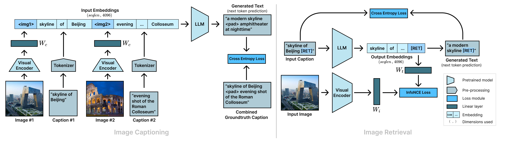
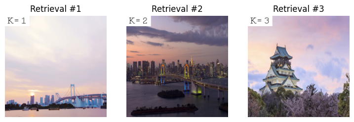
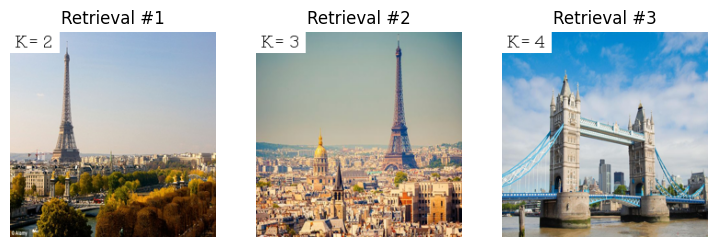
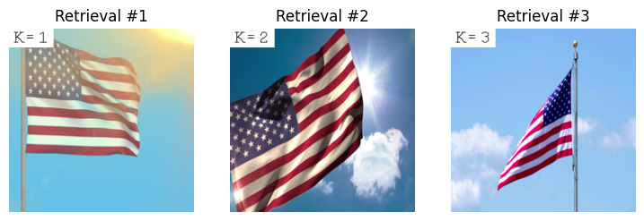

# Exploring Visual Grounding in FROMAGe using Visual Arithmetics

## Introduction

Recent advancements in Artificial Intelligence owe much of their success to the rapidly evolving field of Language Modelling. Large Language Models (LLM) are trained on extensive text corpora and showcase impressive capabilities, such as generating human-like dialogue, answering complex questions, and learning new tasks from minimal examples. However, can a model solely focused on language truly be considered "intelligent"?

One way to adapt a model to another domain is through grounding. In the case of vision and language, grounding can be achieved by aligning the embedding spaces of both modalities.

The field of vision-language models has seen several approaches, each exploring different methods to achieve multimodal integration. Among these approaches, an efficient and promising framework called FROMAGe (Frozen Retrieval Over Multimodal Data for Autoregressive Generation) stands out.

## Unveiling the Architecture of FROMAGe: A Fusion of Vision and Language 

FROMAGe (Koh et al., 2023) employs a pretrained language model and a pretrained visual encoder, both kept frozen, to ground language models visually. This grounding is achieved by appending various linear mapping layers to align the pretrained models, and training the combined model with a multitask objective for image captioning and image-text retrieval. 

### The Main Building Blocks

FROMAGe operates based on the publicly available OPT-6.7B (Zhang et al., 2022) language model that was initially trained on text-only data using a maximum likelihood objective. Following this initial training, the parameters remain frozen.  Given an input text (e.g. an image caption), a sequence of tokens are extracted with a byte-level BPE tokenizer (Sennrich, Haddow & Birch, 2015).

To extract visual information from an input image corresponding to a caption, FROMAGe’s visual component consists of the pretrained CLIP ViT-L/14 model (Radford et al., 2021). The CLIP weights are kept frozen as well. 

### Integration of Language and Visual Components

To blend language and visual input, FROMAGe introduces translation parameters to bridge the gap between the image and text embedding spaces. Which particular mapping is used, depends on each of the two training tasks.

#### Image-to-Text Mapping 

For image captioning, the model learns a linear mapping $\mathbf{W}_c$ to transform the visual embeddings of an image into the language space. The resulting vectors have the same hidden dimensionality as the text embeddings that the LLM generates. 

#### Text-to-Image Mapping 

FROMAGe retrieves images using an autoregressive language model. However, this model's causal attention over text is less expressive than bidirectional attention. To address this, a special [RET] token is added to the language model's vocabulary. During training, the [RET] token is appended to input captions, enabling an additional step of attention and creating a stronger text representation. The [RET] token also facilitates image retrieval. To map the language model's output to the visual space, the hidden representation of the [RET] token is passed through a linear mapping $\mathbf{W}_t$. The intuition behind this is to obtain the hidden representations that lead to the outputting of the [RET] token, as these will be most informative for retrieval. Similarly, a linear mapping $W_i$ is trained to map visual embeddings to the same retrieval space.

### Training Setup 

As mentioned previously, FROMAGe employs a multi-task objective for training, which includes image captioning and image-text retrieval.  An overview of both training pipelines is depicted here:

####  Image Captioning Task
The image captioning task involves generating text tokens conditioned on a visual prefix. The visual prefix is the output of the image-to-text mapping layer, which is prepended to the tokenized caption. The text is generated autoregressively, based on the previous tokens and the visual prefix. The captioning loss is then the negative log likelihood of all samples in a batch of image-text pairs.

To encourage the model to attend more explicitly to images, distinct examples are randomly concatenated together with a probability of 0.5.

#### Image-text retrieval
The image-text retrieval task focuses on retrieving images conditioned on text and vice versa. Given a caption $x$ and its paired image $y$, the output of the last hidden layer of the LLM for the [RET] token and the output of the visual encoder for the image are extracted. The normalized cosine similarity for the image and text embeddings can then be computed after mapping each embedding with the corresponding mappings $W_t$, and $W_i$.

The InfoNCE loss is minimized for both text-to-image and image-to-text retrieval over a batch of text-image pairs with contrastive learning. Each true image-caption pair is treated as a positive example, and other in-batch pairs are treated as negatives.

The final training loss is a weighted sum of the captioning loss and the two InfoNCE retrieval losses.

Notably, only the linear mappings and the [RET] embedding vector are updated during training. The authors of FROMAGe explicitly refrain from fine-tuning either of the main models, because they argue that this would adapt the parameter configurations that make these models so powerful in their respective domains. They also reason this enables better generalization for in-context learning.

## Visual Relations benchmark

Visual arithmetic tasks provide an interesting paradigm for exploring the grounding capabilities of multimodal language models. These tasks involve the ability to comprehend, reason, and make decisions based on visual inputs - a challenge that requires a deep level of grounding in the visual world. 

To evaluate FROMAGe's visual grounding, we leverage the Visual Relations benchmark proposed by Tewel et al. (2022). They propose the ZeroCap method, which combines CLIP (Radford et al., 2021) and GPT-2 (Radford et al., 2019) without additional finetuning. Their experimental model has the potential of providing zero-shot captioning, bringing together a realistic textual variability, recognition abilities independent from object categories, and real-world knowledge embedded in the two models.

### Visual Arithmetics
To demonstrate the multimodal reasoning of their model, Tewel et al. (2022) study its capabilities in visual-semantic arithmetics. Their proposed task is inspired by the famous examples introduced by Mikolov et al. (2013). In their word2vec paper, they show that simple algebraic operations performed on word embeddings can reveal semantic relations between the words they encode.
> vector("King") - vector("Man") + vector("Woman") ~ vector("Queen")

Tewel et al. (2022) extend this idea to the visual domain and show that their model is able to solve a similar task with images:

As a closely related task, they propose to generate real-world knowledge using the relations between images. As an example, they formulate the question *"Who is the president of Germany?"* as an arithmetical expression. They create a "presidential direction" by subtracting the embedding of an image of Obama from the embedding of an image of the USA's flag, and then add the embedding of an image of Germany's flag. They then use the resulting embedding vector as an input for the language model, which generates "Angela Merkel":

### Relations in the Benchmark

To allow the visual reasoning abilities of multimodal models to be tested, Tewel et al. (2022) introduce a new benchmark. It comprises 320 relations between 74 images in five relation categories:
* buildings &rarr; country
* countries &rarr; capital
* foods &rarr; country
* leaders &rarr; country
* CEO &rarr; company

These templates are specifically chosen for their many-to-one association, exemplified by the fact that a country can host a myriad of buildings, yet each building typically pertains to a single country.

### Extending Benchmark Possibilities: FROMAGe's Capability for Image Retrieval
Although Tewel et al. (2022) show that their model is able to use text strings instead of visual input (by replacing images in the equations with strings), their benchmark is formulated as applying arithmetic operations to visual embeddings and then generating text based on that embedding. In other words, the benchmark was constructed to do equations in the form *image + (image - image) ~ text*.

While FROMAGe models are capable of outputting images (by retrieving them from a database), the architecture of the ZeroCap model prevents it from outputting anything else than text. Based on this additional capability of FROMAGe models, we extend the benchmark and do not only generate text from the embeddings, but also retrieve images and evaluate how well they match the expected result. In other words, we also experiment with equations in the form *image + (image - image) ~ image*. 

## Mapping, Generation, and Retrieval

To apply the FROMAGe model to visual analogy resolution, we make use of both pipelines discussed earlier. Which pipeline is used, depends on the prompting strategy. 
In each case, all images in the benchmark are processed using the visual encoder to extract its visual embedding. Each of them is then passed through $W_c$ to be mapped to the LLM input space. This is done ahead of time to reduce the model’s  memory size and speed up computation time.

### Image-to-Text: Comparison with ZeroCap (ZeroVisText)

The simplest approach is that inspired by Word2Vec, where the analogy resolution (i.e. image arithmetic) is explicitly performed on the image embeddings prior to prompting: 

    result = model.visual_embs['leaders/obama'] - model.visual_embs['flags/usa'] + model.visual_embs['flags/germany']
    prompt = [result]

To directly compare this method to ZeroCap, only textual output is generated. In this approach, the captioning pipeline is employed.  Though the main objective during image captioning was not to generate the [RET] token, the model is capable of doing so. For this reason we set the RET scaling factor to 0, ensuring [RET] is not generated and no retrieval is performed. The precalulated embedding is fed to the LLM as the visual prefix, with no other tokens. The model then generates text representations of up to five tokens based on the prefix.

### Image-to-Image: Beyond textual output (ZeroVisImage)

The next approach is very similar to the previous one, except we retrieve images instead of text. For this reason, the image-text retrieval pipeline is employed. We construct the prompt in the same manner, but now append it with the [RET] token:

    result = model.visual_embs['leaders/obama'] - model.visual_embs['flags/usa'] + model.visual_embs['flags/germany']
    prompt = [result, '[RET]']
    
Next, the input sequence is passed through the language model, which generates output representations. To map these representations to the visual space for retrieval, the representation of the [RET] token from the last hidden layer of the language model is fed through the $W_t$ layer.

Finally, the resulting embedding is compared to the precomputed embeddings of the CC3M images using normalized cosine similarity. Based on the computed similarity, the top three images are retrieved as the resolution to the visual analogy.

### Image-to-Image: Multimodal prompting (ZeroVisMulti)

In the case of the multimodal prompting approach, the prompt consists of a textual prompt interleaved with previously embedded images mapped to the LLM space:

    task = ['Task description: Finish the analogy.']
    prompt = task + [['countries/usa'], ' is to ', ['leaders/obama'], ' as ', ['countries/germany'], ' is to ']

For this approach, the image captioning pipeline is employed. We do this as we hope that the text generation will provide useful information for the [RET] token. In order to encourage the generation of the [RET] token, we set the RET scaling factor to 1.3 based on empirical findings. 
The LLM then generates text representations based on the input, ending in a [RET] token. To map these representations to the visual space for retrieval, the representation of the [RET] token from the last hidden layer of the language model is fed through the $W_t$ layer.

In the same manner as previously described, the resulting embedding is compared to the precomputed embeddings and the three most similar images are retrieved.

## Results

We report results for the three methods mentioned in the last section. 

### Image-to-Text: Comparison with ZeroCap (ZeroVisText)

The first approach, as it is word2vec-inspired and produces textual output, can be assessed quantitatively using the visual relations benchmark. To allow direct comparison, we add our results to the table mentioned in the ZeroCap paper. For consistency reasons, we report the same metrics:

<table>
    <caption style="caption-side: bottom">
        Comparison of FROMAGe with ZeroCap and ClipCap on the Visual Relations benchmark.
         B@1 = BLEU-1, R@5 = Recall@5, C-s = CLIPScore
    </caption>
    <tr>
        <th colspan=1 style="text-align:center">Method</th>
        <th colspan=3 style="text-align:center">Building &rarr; Country</th>
        <th colspan=3 style="text-align:center">Country &rarr; Capital</th>
        <th colspan=3 style="text-align:center">CEO &rarr; Company</th>
        <th colspan=3 style="text-align:center">Food &rarr; Country</th>
        <th colspan=3 style="text-align:center">Leader &rarr; Country</th>
    </tr>
    <tr>
        <th style="text-align:center"></th>
        <th style="text-align:center">B@1</th>
        <th style="text-align:center">R@5</th>
        <th style="text-align:center">C-s</th>
        <th style="text-align:center">B@1</th>
        <th style="text-align:center">R@5</th>
        <th style="text-align:center">C-s</th>
        <th style="text-align:center">B@1</th>
        <th style="text-align:center">R@5</th>
        <th style="text-align:center">C-s</th>
        <th style="text-align:center">B@1</th>
        <th style="text-align:center">R@5</th>
        <th style="text-align:center">C-s</th>
        <th style="text-align:center">B@1</th>
        <th style="text-align:center">R@5</th>
        <th style="text-align:center">C-s</th>
    </tr>
    <tr>
        <td>ClipCap</td>
        <td>0.003</td><td>0.035</td><td>0.24</td>
        <td>0.0</td><td>0.0</td><td>0.22</td>
        <td>0.004</td><td>0.05</td><td>0.18</td>
        <td>0.0</td><td>0.0</td><td>0.24</td>
        <td>0.008</td><td>0.24</td><td>0.26</td>
    </tr>
    <tr>
        <td>ZeroCap</td>
        <td>0.1</td><td>0.32</td><td>0.7</td>
        <td>0.14</td><td>0.32</td><td>0.68</td>
        <td>0.1</td><td>0.3</td><td>0.64</td>
        <td>0.03</td><td>0.33</td><td>0.66</td>
        <td>0.1</td><td>0.28</td><td>0.68</td>
    </tr>
    <tr>
        <td>FROMAGe</td>
        <td>0.004</td><td>0.018</td><td>0.155</td>
        <td>0.0</td><td>0.0</td><td>0.152</td>
        <td>0.0</td><td>0.0</td><td>0.161</td>
        <td>0.0</td><td>0.0</td><td>0.159</td>
        <td>0.002</td><td>0.006</td><td>0.140</td>
    </tr>
<!--    <tr>
        <td>word2vec (top-p)</td>
        <td>0.004</td><td>0.018</td><td>0.153</td>
        <td>0.0</td><td>0.0</td><td>0.153</td>
        <td>0.0</td><td>0.0</td><td>0.153</td>
        <td>0.0</td><td>0.0</td><td>0.152</td>
        <td>0.0</td><td>0.0</td><td>0.139</td>
    </tr>
    <tr>
        <td>Prompting (greedy)</td>
        <td>0.0</td><td>0.0</td><td>0.150</td>
        <td>0.0</td><td>0.0</td><td>0.149</td>
        <td>0.012</td><td>0.05</td><td>0.162</td>
        <td>0.0</td><td>0.0</td><td>0.167</td>
        <td>0.0</td><td>0.0</td><td>0.148</td>
    </tr>
    <tr>
        <td>Prompting (top-p)</td>
        <td>0.0</td><td>0.0</td><td>0.153</td>
        <td>0.0</td><td>0.0</td><td>0.151</td>
        <td>0.0</td><td>0.0</td><td>0.16</td>
        <td>0.0</td><td>0.0</td><td>0.168</td>
        <td>0.0</td><td>0.0</td><td>0.148</td>
    </tr>-->
</table>

Quantitatively, FROMAGe consistently underperforms both the ZeroCap baseline and ClipCap (a model which combines CLIP and GPT-2 based on an approach similar to FROMAGe's), introduced by Mokady et al. (2021). 

In a qualitative evaluation, we found that the model often generates token sequences which are rarely unrelated to the specific entity, but instead roughly approach the category we're looking for:
* country: *"a map of the country"* or *"flag with the flag and"*
* capital: *"a city skyline at dusk"* or *"a view of the city"*
* company: *"the logo of the company"* or *"the comapny is worth more"*
* leader: *"politician is a politician"* or *"politician, who is"*

We illustrate this general finding with the following two examples, where the analogies should resolve to Microsoft and Beijing but the generated output approximates the concepts of company and city, respectively:

    CEOs/bill_gates + (companies/facebook - CEOs/mark_zuckerberg)
    Expected result: companies/microsoft
    Model generated outputs: the logo of the company

    flags/china + (cities/berlin - flags/germany)
    Expected result: cities/beijing
    Model generated outputs: a view of the city

In rare cases, the model generates descriptions of the analogy's solution, e.g., *"australian city"* instead of Canberra:

    flags/australia + (cities/bangkok - flags/thailand)
    Expected result: cities/canberra
    Model generated outputs: australian city

In this curious example, we found a *pars-pro-toto* releationship between the output and the expected solution - *"the city of the dead"* is the frequently used English designation of al-Qarafa, a vast necropolis located in Cairo.

    flags/egypt + (cities/moscow - flags/russia)
    Expected result: cities/cairo
    Model generated outputs: the city of the dead

In conclusion, the model struggles in solving the arithmetic tasks. It often generates output that goes into the direction of the expected category, and sometimes manages to describe the expected entity.

For more information, including prompt and outputs, we refer the reader to this [notebook](./demos/Visual-Arithmetics/Image-to-Text/arithmetic_ICap_greedy.ipynb).

### Image-to-Image: Beyond textual output (ZeroVisImage)

In the second experiment, we let the model retrieve three images instead of generating text. For each of the following examples, we present the input arithmetic and the top 3 images the model retrieved.

We find that, from time to time, the model is capable of correctly resolving the analogy. We illustrate this with the following four examples, where the model correctly retrieves three images of:
* London (featuring the Tower Bridge)
* London (featuring the London Eye, the County Hall, and the Clock Tower with the Big Ben)
* a British leader (Queen Elizabeth II)
* Paris (featuring the Eiffel Tower)

> flags/england + (cities/paris - flags/france)

> flags/england + (cities/washington - flags/usa)

> flags/england + (leaders/angela_merkel - flags/germany)

> flags/france + (cities/tokyo - flags/japan)

In another example, where the analogy should yield Tokyo, the model correctly finds two images of Tokyo (featuring the Rainbow Bridge), while the third image retrieved shows the main tower of Osaka Castle (located in Osaka), which - depending on the perspective - resembles the Ken'ey-ji temple in Tokyo.

> flags/japan + (cities/berlin - flags/germany)

Another example worthwhile to mention closely misses the expected result, an image of Canberra. Instead, two images feature the Uluru rock (located in central Australia), and the third image features the Sydney Opera House. Given that Tewel et al. (2022) report the same confusion with their model, we can assume that the benchmark's "capital direction" actually is interpreted as a "most characteristic city direction".

> flags/australia + (cities/cairo - flags/egypt)

One might have observed in the previous examples that the retrieved images for each analogy usually bear a strong visual resemblance to one another. This similarity is further demonstrated in the subsequent examples, where FROMAGe retrieves:

* An image depicting Vietnam along with two images portraying China when the analogy points to China. This is noteworthy given that both countries, apart from sharing a border, also feature yellow stars on a red background in their national flags.
* Three images of the Taj Mahal when the analogy refers to Washington. The resemblance between the white dome of the Taj Mahal and the architectural elements and gardens of the White House could explain this choice.
* An image each of the Tower of London (located in the city of London) and Windsor Castle (situated 35 km from London). Both images present a castle-like structure accompanied by a British flag, highlighting their visual congruity.
* While the model accurately retrieves an image of Havana, the remaining two images, although not representing Havana, are characterized by a similar color scheme.
* In a similar manner, the model successfully retrieves an image of Moscow, while the other two images, despite not being of Moscow, depict buildings with similar architectural features. 

> building/china_wall + (countries/egypt - building/pyramid)\

> flags/usa + (cities/bangkok - flags/thailand)\

> flags/england + (cities/cairo - flags/egypt)\

> flags/cuba + (cities/bangkok - flags/thailand)\

> flags/russia + (cities/bangkok - flags/thailand)\

In conclusion, FROMAGe is, in some cases, capable  of resolving the analogies and retrieving at least some images of the corresponding solution.  In the majority of the cases, however, the retrieved images do not coincide with the expected output. It is worthwhile to mention that the three retrieved images typically exhibit visual similarity.

For more information, including prompt and outputs, we refer the reader to this [notebook](./demos/Visual-Arithmetics/Image-to-Image/arithmetic_ITRet.ipynb).

### Image-to-Image: Multimodal Prompting (ZeroVisMulti)

In the third experiment, the FROMAGe model is directly prompted using the analogy. For each of the following examples, we present the given prompt, the text that the model generates in response, and the top three images that are retrieved.

In the subsequent examples, it's observed that while the model primarily leans on the prompt for image retrieval, it also incorporates elements of the generated text:
* In a scenario where the aim is to retrieve images representing the USA, the model retrieves images of China, given its mention in the analogy (note that the model again confuses Vietnam with China due to the image representations' similarity). The retrieved images are all of the country's border shape with an overlay of the flag, mirroring the generated text - 'map of the country with the flag in the background'.
* When the analogy's first component is '[flags/egypt]', the model retrieves images of the Egyptian flag. Interestingly, the model generates the text *"iPhone app"*, and consequently retrieves images of the Egyptian flag with shapes reminiscent of mobile apps.
* When the analogy begins with '[flags/usa]', the model retrieves images of the American flag. The generated text contains *"great country"*, a phrase frequently used in American rhetoric, multiple times.
* When '[flags/china]' is the first component of the analogy, the model retrieves images of the Chinese flag. The model generates text that can be interpreted to reference China's long history and the governance of the Chinese government.

> [building/china_wall] is to [contries/china], as [building/capitol] is to\
> generated output: *iaf map of the country with the flag in the background [RET]*\

> [flags/egypt] is to [cities/cairo], as [flags/england] is to\
> generated output:  *iphone app [RET]*\

> [flags/usa] is to [cities/washington], as [flags/australia] is to\
> generated output:  *ive been a great country for a long time and i think it will continue to be a great country [RET]*\

> [flags/china] is to [cities/beijing], as [flags/germany] is to\
> generated output:  *ive been a country for a long time, but it is now a country in the hands of the chinese government [RET]*\

Contrasting to cases where the retrieval is primarily based on the input prompt, we find other cases where heavy emphasis is placed on the model-generated text. Here, while the analogy would resolve to Washington, the model generates a sequence containing *"the most popular destinations for tourists"*, subsequently retrieving images of Paris and London:

> [flags/france] is to [cities/paris], as [flags/usa] is to\
> generated output:  *ive been to the top of the most popular destinations for tourists [RET]*\

Note how the ability of generating text before retrieving images enables the model to reason about the prompt and then retrieve the images based on this reasoning. The following unconventional result illustrates this "cognitive approach". The model's input includes [flag/japan], leading the model to generate *"ia flag with the sun in the sky"* (a description fitting the Japanese flag). However, image retrieval based on this phrase results in a literal interpretation, consequently producing images of the American flag positioned against a sunlit sky:

> [flags/germany] is to [cities/berlin], as [flags/japan] is to\
> generated output:  *is flag with the sun in the sky [RET]*\

While some of the retrieved images can clearly be attributed to either the prompt or the prefix, the model sometimes manages to pick up on cues of both. Here, the model retrieves images of gold medals after hallucinating text containing the phrase *"a gold medal"*.  Interestingly, it's worth noting that [flags/thailand] is part of the prompt and prompts the model to retrieve medals featuring ribbons that, coincidentally, bear the Thai flag.

> [flags/thailand] is to [cities/bangkok], as [flags/australia] is to\
> generated output:  *ive been to the country to get a country to get a gold medal [RET]*\

A similar pattern is observed in the following example. It retrieves images of countries and cities on earth, influenced by the generated text. However, in two out of three images, China is in the center, arguably due to the inclusion of [flags/china] in the prompt.

> [flags/australia] is to [cities/canberra], as [flags/china] is to\
> generated output:  *ive been to all the countries in the world [RET]*\

While the retrieval of images is primarily influenced by cues present in the prompt and the prefix, there are instances where the model effectively retrieves images corresponding to the intended solution of the analogy.

For instance, in a situation where the analogy should ideally result in the representation of the company 'Apple', the model aptly interprets the analogy, generating the phrase 'iphone app' and consequently retrieves images of iPhones. While this seems like a promising result, it is important to mention that the phrase *"iphone app"* is generated on multiple occasions, even when Apple is not the anticipated result.

> [CEOs/mark_zuckerberg] is to [companies/facebook], as [CEOs/steve_jobs] is to\
> generated output: *iphone app [RET]*\

Similarly, in this case, the model generates the phrase "ive been a great president" The presence of the word "president" indeed influences the model to retrieve images of Barack Obama. However, it's essential to point out that this particular analogy presents an unusual scenario in which the direction toward a president (from [flags/usa] to [leaders/trump]) is constructed using the same country featured in the second part of the analogy ([flags/usa] and the expected result being a US leader).

> [flags/usa] is to [leaders/trump], as [flags/usa] is to\
> generated output:  *ive been a great president [RET]*\

In conclusion, despite initial expectations, the method of direct prompting often yields less satisfactory outcomes in terms of resolving analogies. Instead, the model picks up on cues encountered in the prompt, generates a probable text sequence, and retrieves images based on both the prompt and the generated prefix.

For more information, including prompt and outputs, we refer the reader to this [notebook](./demos/Visual-Arithmetic/Image-to-Image/zero-shot_ICap_greedy.ipynb).

## Limitations of FROMAGe

Grounding LLMs to additional domains can be an effective approach. However, there are a few limitations in the specific way FROMAGe is trained which inhibitis it from achieving a performance comparable to ZeroCap.

### Training on Conceptual Captions
While both CLIP and OPT are trained on high-quality datasets, the FROMAGe-specific components (i.e., the linear layers and the embedding of the [RET] token) are trained on CC3M (Sharma et al., 2018). The same dataset is also used to retrieve images from. As Conceptual Captions datasets are harvested from the web (by leveraging the alt-text attribute of HTML), they offer a significantly higher variety than carefully curated datasets. However, many entities are replaced by hypernyms (e.g., "actor" instead of a specific name). We suspect that this "information loss" has a negative effect on FROMAGe's ability to pass on information from the visual to the textual components (which can be seen in the following [notebook](https://github.com/nils2/DL2-ZeroVis/tree/main/demos/Extra-Studies/Availability/txt-to-img) and [folder](https://github.com/nils2/DL2-ZeroVis/tree/main/demos/Extra-Studies/Availability/img-to-img)).

### LLM not trained for instructions
The OPT-6.7B model was not instruction-tuned. Providing it with additional examples in a few-shot setting did not improve performance (as is shown in this [notebook](./demos/Extra-Studies/few-shot-cot_ICap_greedy.ipynb)).

### Susceptibility to textual input
During our experiments (available in this [folder](https://github.com/nils2/DL2-ZeroVis/tree/main/demos/Extra-Studies/Availability/txt-to-img)), we sometimes observed an additional limitation of the FROMAGe model: There were significant disparities in the quality of the model's output that could be triggered by minor variations in the input text. Remarkably, even slight differences in word capitalizations could compromise the output. We illustrate this phenomenon using two examples:
* When prompting the model for an image of "apple the company", the model retrieves images of the fruit apple. However, capitalizing "Apple" in the same prompt leads to the retrieval of Apple's logo.
* Nonetheless, it is worth noting that standardized capitalization does not guarantee favorable results: Prompting the model with "Image of australia the flag" leads to a better precision@3 than using the correctly capitalized form "Australia".

These subtle disparities in the textual input are beyond the user's control but can significantly influence the model's performance.

### Image URL availability
One notable technical limitation arises from the specific way FROMAGe accesses the CC3M dataset, which is stored in a decentralized manner and lacks long-term availability guarantees. Consequently, some of the images linked to through the provided URLs are no longer accessible. To address this issue, we employ a fallback approach that retrieves the next-best output while indicating the position of the image candidate (note the *k=N* box in the upper-left corner of each image). Because this limitation can make it difficult to draw comprehensive conclusions about the model's capabilities, especially when k is high, we report results with low k values.

## Conclusions

The quantitative results for the ZeroVisText approach show that FROMAGe underperforms both ZeroCap and ClipCap. We hypothesize that the main reason for this is that the linear layers which ground the LLM to the visual domain are trained on CC3M, and that a model trained on a dataset with more world knowledge would perform better. The qualitative analysis of the results in the ZeroVisText and ZeroVisImage settings back this assumption.

With the ZeroVisImage approach, no textual input is provided to the LLM. Instead, the [RET] token is computed solely based on the visual embedding. It is reasonable to hypothesize that the emphasis in the model's operation may be on the visual encoding, rather than any significant contribution from the LLM. This hypothesis is further supported by the observation that retrieved images typically exhibit visual similarity. This tendency towards visual similarity can also serve as an explanatory factor for some of the incorrect results observed in the model's output.

Despite initial expectations, the method of direct prompting in the ZeroVisMulti approach often yielded less satisfactory outcomes in terms of resolving analogies. As mentioned previously, the underlying LLM isn't specifically trained to follow instructions, hence it typically produces a probable continuation of the given prompt. Nevertheless, there is evidence suggesting that text generation could be advantageous, particularly with a model that's tuned to follow instructions. Generating text before initiating image retrieval provides the model with an opportunity to interpret the analogy, which means that image retrieval isn't solely based on visual similarity, as observed in the ZeroVisImage method. By doing so, the model can incorporate information that's semantically relevant from the language model, alongside visually relevant data from the visual encoder. This holistic approach has the potential to lead to more accurate resolution of analogies.

## Summary

* Building upon the foundational paper that introduced FROMAGe, some novel insights into its visual arithmetic capabilities have been shown. Although unable to perform the analogy resolution as expected, findings pertaining to the generation of text prior to image retrieval were promising. 
* Evaluation of the impact of latent zero-shot in-context learning abilities of large language models (LLMs) on visual arithmetic.
* Demonstrated the influence of multimodal inputs on visual arithmetic. We furnish a deeper understanding of the interaction between different modalities in multimodal models, especially in tasks they are not trained on.

## Limitations of the Benchmark

### Entity categories

In addition to its small size, the Visual Relations benchmark possesses a notable shortcoming in terms of category definition. To illustrate this, we employ t-Distributed Stochastic Neighbor Embedding (T-SNE) (Van der Maaten et al., 2008). T-SNE is a non-linear dimensionality reduction algorithm known for its ability to preserve local structure within high-dimensional datasets. It calculates the similarity of data points in a high-dimensional space and maps them into a lower-dimensional (in our case, two-dimensional) space by leveraging gradient descent to minimize the Kullback-Leibler divergence between the different dimensionalities. We apply T-SNE to the embeddings after encoding the benchmark's images with the ViT.

As is apparent in the T-SNE plot, there are two overlapping clusters (*countries* with *flags* and *cities* with *buildings*). We attribute these overlaps to the fact that the images representing countries feature the country's flag and the images representing cities feature characteristic buildings located in the city in question. A contrastive example of closely related but non-overlapping clusters is the one of leaders and CEOs. The minimal distinctions between the overlapping categories, especially in the striking case of *countries* and *flags*, might not be picked up by vision-language models, wherefore we question the rationale behind the separate handling of these categories.

### Many-to-one relationship

The relation templates appearing in the benchmark were, according to Tewel et al. (2022), specifically chosen because of their many-to-one character. However, the relation between countries and leaders is handled ambiguously in the ZeroCap paper: the scores reported in the paper are for *leaders &rarr; country*, while the examples illustrate *country &rarr; leaders*. Furthermore, the template *country &rarr; capital* is not many-to-one: from the few countries deviating from a one-to-one mapping, a few have multiple constitutional and/or *de-facto* capitals (i.e., one-to-many, e.g., Montenegro, South Africa, and Bolivia), and one - Nauru - does not have a constitutional capital (i.e., one-to-zero). No city satisfies the many-to-one criterium by being the capital of multiple countries.

### Difficult to apply
In addition to these conceptual issues, the benchmark lacks a proper definition. The authors provide images of the entities and a short list of example relations. However, for the results to be comparable, the benchmark would at least need a closed list of relations to be tested, and optimally also specifications on how to apply the metrics.

## Limitations of Our Work

### Comparison to ZeroCap
As a consequence of the vague definition of the benchmark, our numeric results are hardly comparable to the scores of ZeroCap and ClipCap reported by Tewel et al. (2022). We cannot exclude differences due to possibly different relations or to the application of the metrics. Furthermore, the following aggregations of different templates into the same column have to be taken into account:
* While the last column is *leaders &rarr; country*, we tested relations of the form *country &rarr; leaders*, as apparent in the ZeroCap examples. However, *leaders &rarr; country* might be considered the more logical direction, as it better fulfils the many-to-one requirement.
* All templates featuring *country* are reported as such in the ZeroCap paper. However, as the benchmark's country category does not contain each country mentioned in the example relationships, we had to fall back to using images from the "flag" category. Therefore, results aggregated in a "country" column also feature, at least in the FROMAGe row, relations containing "flag" images.

### Qualitative analysis of image output
While our qualitative analysis provides a comprehensive insight into the model's capabilities, our experiments with visual output are hardly comparable to other models or settings, as our study lacks quantitative analysis.

## Future Research

To allow comparison also between visual outputs, it is crucial to introduce reliable quantitative evaluation measures as well as better applicable benchmark datasets for (semi-)automatic evaluation, facilitating a more generalizable analysis.

We indicate two additional promising avenues for extending our research. Firstly, we only use one task to test the degree to which FROMAGe is grounded to the visual domain. While the task of visual arithmetics arguably is a good proxy to measure this, more tasks could give a more general insight into the model's capabilities. Secondly, we analyse the capabilities of one model only. Further research could test additional models and compare their performance.

## Individual Contributions
* Joy
    * Adapted and debugged the FROMAGe model into the fromage\_inf model. Co-wrote the blogpost and performed an in-depth analysis of the experimentations.
* Emile
    * Performed an ablation study and created images for this blogpost.
* Dominik
    * Co-wrote the blogpost and performed an in-depth analysis of the experimentations.
* Gergely
    * Coded the Parser and ReadMe with a download script.
* Nils
    * Adapted and debugged the FROMAGe model into the fromage\_inf model. Designed the multiple studies in 'demos/'.

## References

Koh, J. Y., Salakhutdinov, R., & Fried, D. (2023). Grounding language models to images for multimodal generation. arXiv preprint arXiv:2301.13823.

Zhang, S., Roller, S., Goyal, N., Artetxe, M., Chen, M., Chen, S., ... & Zettlemoyer, L. (2022). Opt: Open pre-trained transformer language models. arXiv preprint arXiv:2205.01068.

Sennrich, R., Haddow, B., & Birch, A. (2015). Neural machine translation of rare words with subword units. arXiv preprint arXiv:1508.07909.

Radford, A., Kim, J. W., Hallacy, C., Ramesh, A., Goh, G., Agarwal, S., ... & Sutskever, I. (2021, July). Learning transferable visual models from natural language supervision. In International conference on machine learning (pp. 8748-8763). PMLR.

Radford, A., Wu, J., Child, R., Luan, D., Amodei, D., & Sutskever, I. (2019). Language models are unsupervised multitask learners. OpenAI blog, 1(8), 9.

Tewel, Y., Shalev, Y., Schwartz, I., & Wolf, L. (2022). Zerocap: Zero-shot image-to-text generation for visual-semantic arithmetic. In Proceedings of the IEEE/CVF Conference on Computer Vision and Pattern Recognition (pp. 17918-17928).

Mikolov, T., Chen, K., Corrado, G., & Dean, J. (2013). Efficient estimation of word representations in vector space. arXiv preprint arXiv:1301.3781.

Mokady, R., Hertz, A., & Bermano, A. H. (2021). Clipcap: Clip prefix for image captioning. arXiv preprint arXiv:2111.09734.

Sharma, P., Ding, N., Goodman, S., & Soricut, R. (2018, July). Conceptual captions: A cleaned, hypernymed, image alt-text dataset for automatic image captioning. In Proceedings of the 56th Annual Meeting of the Association for Computational Linguistics (Volume 1: Long Papers) (pp. 2556-2565).

## Appendix

### A: Additional findings

While evaluating the outputs qualitatively, we observed some consistent associations, whose foundation we can only assume. For instance, when [flags/england] is incorporated into the prompt, the Brunei flag appears in the retrieved images on multiple occasions. However, there is no visual correlation between the flags, and the historical connection—Brunei being a British protectorate from 1888 to 1983—appears to be tenuous.

> [flags/england] is to [leaders/boris_johnson], as [flags/russia] is to\
> generated output:  *ive been a long time favorite of the flag [RET]*\

Contrasting to these very clear examples, in some cases, the model retrieves more diverse images which still relate to the prompt, although to a lesser extent. In the following example, the model retrieves 
* the flag of Australia (which can be conceptually related to the British flag)
* the flag of Wales (note that [flags/england] actually is the British flag and that Wales is part of the United Kingdom)
* a red baseball cap with the words "Make America Great Again", which be based either on [flags/usa] in the input or the actual expected result (a US-american leader)

> [flags/england] is to [leaders/boris_johnson], as [flags/usa] is to\
> generated output:  *ive been saying [RET]*\

### B: Extra studies

One of the extra studies performed was a multi-modal variations of the same prompts, which can be found in this [notebook](https://github.com/nils2/DL2-ZeroVis/blob/main/demos/Extra-Studies/multimodal_ICap_greedy.ipynb). In this notebook 
