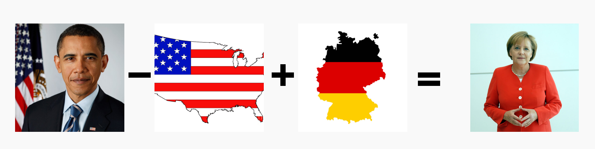

# Chain-of-Thought Prompting and Visual Arithmetic Tasks: Exploring Grounding in FROMAGe
> Joy Crosbie, Emile Dhifallah, Dominik Martínez, Gergely Papp, Nils Peters

## Introduction

### FROMAGe

In the era of evergrowing language models, a key challenge to obtaining models that can reason about vision and text lies in the lack of multimodal grounding. Language models (LM's), are trained on massive text corpora and demonstrate impressive capabilities such as generating human-like dialogue, answering complex questions, and learning new tasks from very few examples. Despite this, they are generally incapable of incorporating visual cues. This significantly limits their performance on tasks that require visual reasoning and grounding. The paper, "Grounding Language Models to Images for Multimodal Generation", addresses this limitation by introducing FROMAGe (Frozen Retrieval Over Multimodal Data for Autoregressive Generation), a multimodal framework which extends the semantic capabilities of LM's to a multimodal (text and image) realm in a very efficient manner.

FROMAGe (Koh et al., 2023) employs a pretrained language model and a visual encoder, both kept frozen, to ground language models visually. This grounding is achieved by training the model with a multitask objective for image captioning and image-text retrieval. For image captioning, the model learns to extract visual embeddings and map them into the input space of the language model through a maximum likelihood objective. On the other hand, for image-text retrieval, the model uses contrastive learning to map the embeddings of a new [RET] token, which represents an image to be retrieved, to the corresponding visual embeddings. This process only updates the weights of the linear layers and the [RET] token embedding, ensuring computation and memory efficiency.

Koh et al. highlight several key strengths of this novel multimodal architecture. Firstly, FROMAGe retains the original abilities of the text-only language model, such as free-form text generation, while also acquiring new multimodal dialogue and reasoning abilities. This means that both model input and outut can be consistently intertwined image and text data. Because the visual embedding space is mapped to the LM's embedding space, the model is able to reason about complex visual cues, akin to CLIP (Radford et al., 2021). Secondly, the model demonstrates strong few-shot multimodal abilities learned from image-caption pairs alone, which is a standout feature as most models require web-scale interleaved image-text data (Alayrac et al., 2022; Aghajanyan et al., 2022). Thirdly, FROMAGe demonstrates superior text-to-image retrieval sensitivity, especially for long and complex free-form text. Lastly, the framework enhances  existing capabilities of pretrained language models, such as in-context learning, input sensitivity, and dialogue generation, for visually grounded tasks.

### Visual Arithmetic Tasks and Grounding

In the context of deep learning, visual arithmetic tasks are, unlike traditional numerical arithmetic, concerned with solving analogies or finding relationships between different (visual) entities. The concept takes inspiration from the vector arithmetic introduced by Mikolov et al. (2013). In their work, they demonstrated that word embeddings can be manipulated using arithmetic operations to reveal semantic relationships between words or concepts. Knowing how concepts lie together in the latent space of a language (or vision-language) also gives clarity on how models encode different concepts. Extending into the visual domain, visual arithmetic tasks involve understanding of and applying a transformation observed in a pair of images to another pair. A classic example would be: if "Obama" is to "USA" as "X" is to "Germany", what is "X"? The correct answer would ideally be "Angela Merkel", following the logic of leaders to their respective countries (note the sensitivity to presence and quality of training data; both are past leaders, but depending on their prominence in the dataset this can either be left out or not). The idea is that because of visual grounding into the text embedding space, complex knowledge about world state translates into the visual domain. If the model explicitly encountered information durng pre-training about the political careers of Obama and Merkel, we expect the model to solve the analogy.

Building on this concept, Tewel et al. (2022) in their work on ZeroCap, applied arithmetic operations to visual embeddings to "generate knowledge of the external world". They perform calculations over a combination of visual and textual inputs by operating in the latent embedding space. However, their methodology relies on CLIP (Radford et al., 2021), a model that can handle visual and textual inputs but only generates textual outputs, thus limiting their arithmetic to natural language output:

> "Who is the president of Germany?"\
> X = image(Obama) - image(USA) + image(Germany) &rarr; "Angela Merkel"

Visual arithmetic tasks provide an interesting paradigm for exploring the grounding capabilities of multimodal language models. These tasks involve the ability to comprehend, reason, and make decisions based on a combination of different visual inputs - a challenge that requires a deep semantic understanding of both textual and visual cues. By applying the FROMAGe model to these tasks, we can gain a better understanding to which it is truly "grounded", and how well this type of grounding can lead to a combined understanding of different modalities. Moreover, with FROMAGe's ability to process and output multimodal data, we are equipped to extend the output of arithmetic operations into the visual domain, overcoming the limitations of using models such as CLIP as a backbone.

## Novel Contributions
Our novel contributions include:
* Building upon the foundational paper that introduced FROMAGe, by offering novel insights into its visual arithmetic capabilities. Our findings will illustrate whether the model can successfully execute complex visual arithmetic operations, thereby broadening our comprehension of FROMAGe's functionality and potential applications.
* Evaluating the impact of latent few-shot in-context learning abilities of large language models (LLMs) on visual arithmetic. By investigating Chain-of-Thought reasoning on a task and modality that these LLMs are not trained on, we present the in-context abilities from a unique viewpoint divergent from previous literature. Our research discloses how the model effectively generalizes from limited examples, markedly enhancing the efficiency and precision of visual arithmetic operations.
* Demonstrating the influence of multimodal inputs on visual arithmetic. We furnish a deeper understanding of the interaction between different modalities in multimodal models, especially in tasks they are not trained on. The insights derived from this exploration bear significant implications for how multimodal models should be trained and utilized.

##  In-context learning for visual arithmetics

### Prompting FROMAGe
In order to investigate how we can use FROMAGe for visual arithmetics, we want to evaluate how well it can retrieve relevant visual data using instructing prompts. To be able to evaluate how well FROMAGe can perform retrieval for visual arithmetics, we evaluate how well the model can perform regular textual analogy resolution (i.e. word vector arithmetics), as well as arithmetics using textual input and visual output ('W2V'), visual output and textual input (equivalent to ZeroCap), and visual input and output. As a result, we can analyze how strong FROMAGe's reasoning capabilities are, and how these are put to work in the grounded setting. We use prompt templates to compare the model on arithmetic tasks in zero-shot, few-shot and chain-of-thought fashion. 

### Visual Relations Benchmark
We make use of the Visual Relations Benchmark introduced in the ZeroCap (Tewel et al., 2023) paper. This benchmark encompasses 320 distinct relationships distributed among multiple image templates, such as buildings→countries, countries→capitals, foods→countries, leaders→countries, and CEOs→companies. These relations were specifically chosen for their many-to-one association, exemplified by the fact that a country can host a myriad of buildings, yet each building typically pertains to a single country. The benchmark is devised to gauge two primary capabilities: the modeling of visual relations and the application of world knowledge in task execution. Although originally devised for single-word answer generation, this dataset also facilitates the retrieval of images that correctly demonstrate visual arithmetic. It is therefore able to handle the multi-modal arithmetics that will be performed using FROMAGe.

### Applying FROMAGe to Visual Arithmetic Tasks

#### Experimental setup

####  W2V approach
Applying the FROMAGe model to visual arithmetic tasks involves processing each image with the CLIP decoder to extract visual embeddings. These embeddings are mapped into the input space of the language model. The arithmetics are then performed on these embeddings and the resulting embedding is concatenated with a [RET] token and passed through the LLM.

Consequently, the FROMAGe model is then tasked to retrieve an image for the analogy based on the resulting [RET] token.

EXAMPLE OF PROMPT WILL BE SHOWN HERE:
> "Who is the president of Germany?"\
> X = image(Obama) - image(USA) + image(Germany) &rarr; image(Angela Merkel)

CORRESPONDING RESULTS WILL BE SHOWN HERE

(@Feedbackers: Examples can be seen in [example](https://github.com/nils2/DL2-ZeroVis/blob/main/demos/example.ipynb) and in [results](https://github.com/nils2/DL2-ZeroVis/blob/main/demos/results.ipynb).

#### Chain-of-Thought Prompting for Visual Arithmetic
Chain-of-thought prompting is a technique aimed at enhancing the reasoning ability of large language models. Rather than presenting a prompt in isolation, it involves including a series of intermediate reasoning steps in natural language within the few-shot prompting process (Kojima et al. 2022). This has been shown to improve performance, particularly for complex reasoning tasks (Wei et al. 2022, Suzgun et al. 2022). When applied in combination with visual arithmetic tasks, it can offer deeper insights into how well the model understands and connects visual and linguistic cues.

In the context of visual arithmetic tasks, chain-of-thought prompting would involve presenting the FROMAGe model with a set of visual analogies along with a series of intermediate reasoning steps. For instance, instead of directly asking "Obama is to the USA as X is to Germany", the model would be guided through the reasoning process: 

EXAMPLE OF PROMPT WILL BE SHOWN HERE

CORRESPONDING RESULTS WILL BE SHOWN HERE

#### T-SNE
NOT FINISHED YET, BUT THE GIST IS THAT WE USE T-SNE TO SEE HOW THE RETRIEVAL EMBEDDINGS CORRELATE AMONGST THEMSELVES, SEE RESULTS NOTEBOOK FOR CODE AND PLOT.

In this study, we leverage t-Distributed Stochastic Neighbor Embedding (T-SNE) (Van der Maaten et al., 2008), a non-linear dimensionality reduction technique that is particularly adept at preserving local structure within high-dimensional datasets. T-SNE calculates the similarity of data points in the high-dimensional space and then maps it to a lower-dimensional space. It uses gradient descent to minimizes the Kullback-Leibler (KL) divergence between the high and low-dimensional representations with respect to the locations of the points in the map. The output is a two- or three-dimensional representation of the data that can be easily visualized, preserving the structure and relationships inherent in the high-dimensional data space as much as possible. This dimensionality reduction algorithm is used to visualize nonlinear relations between the image embeddings, allowing for an better analysis of the retrieved tokens from the FROMAGe model.

## Conclusion
So far all we can conclude is that the task is very difficult and that the benchmark is not a very good one, as the paper it is from mentioned 320 relations (there are only about 39) and they mention in the paper the relation countries-> cities but this should be flags->cities as for example australia in australia->canberra only exists in flags.

## Individual Contributions
